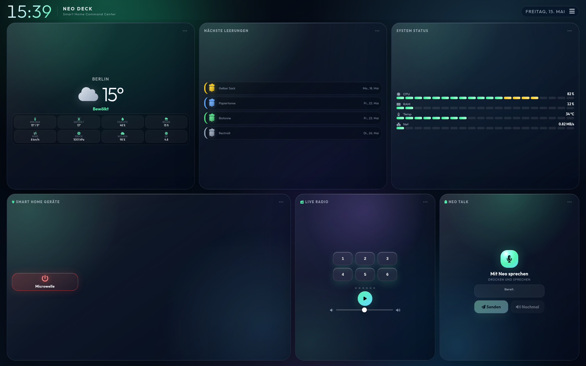
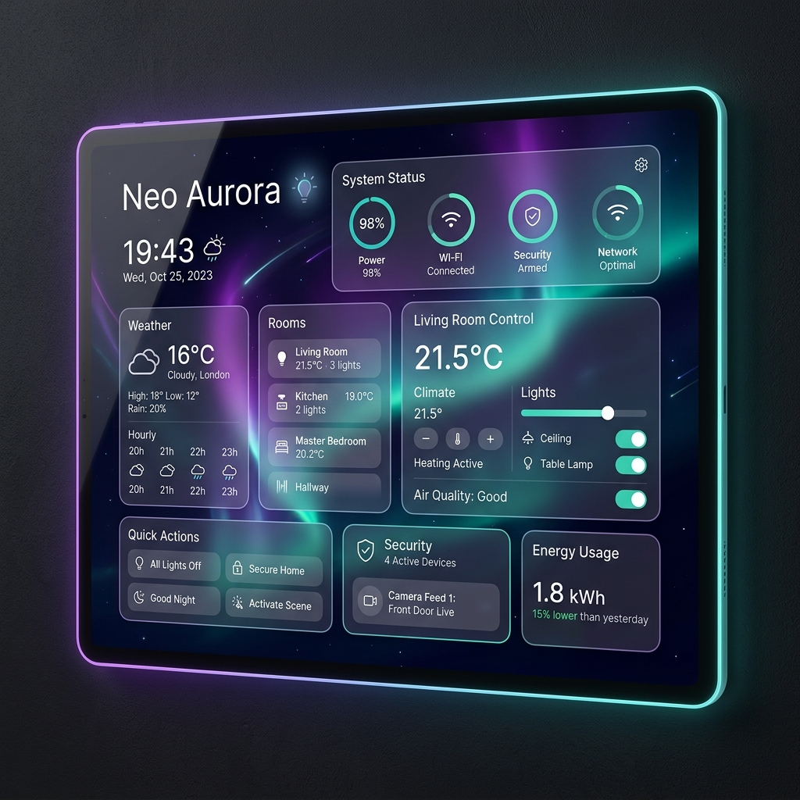
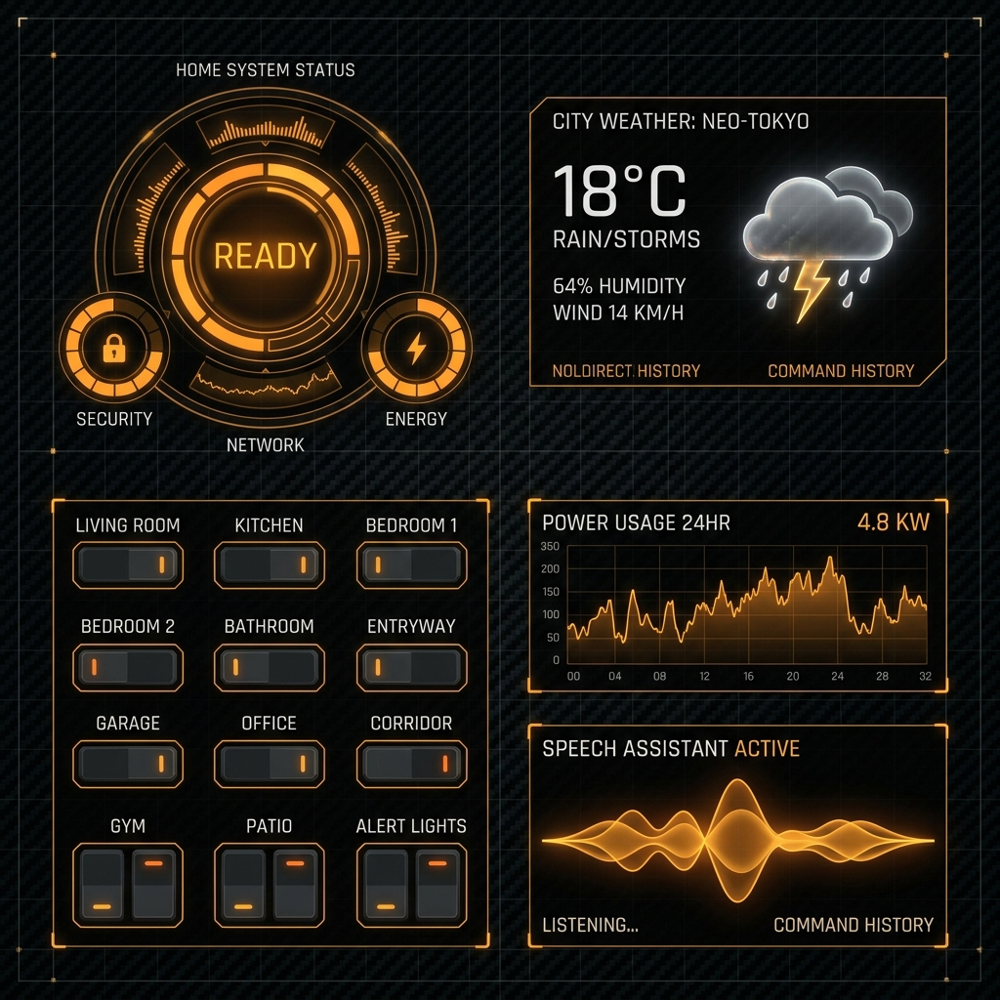
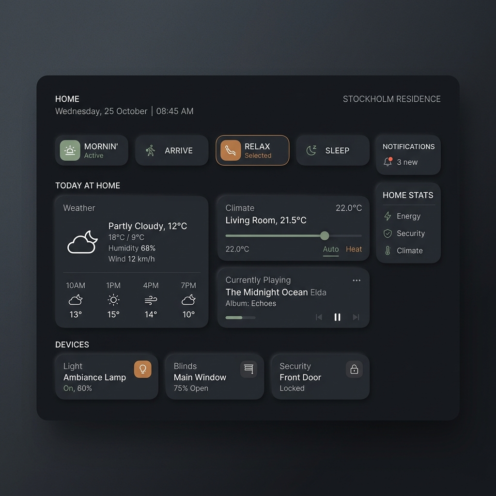
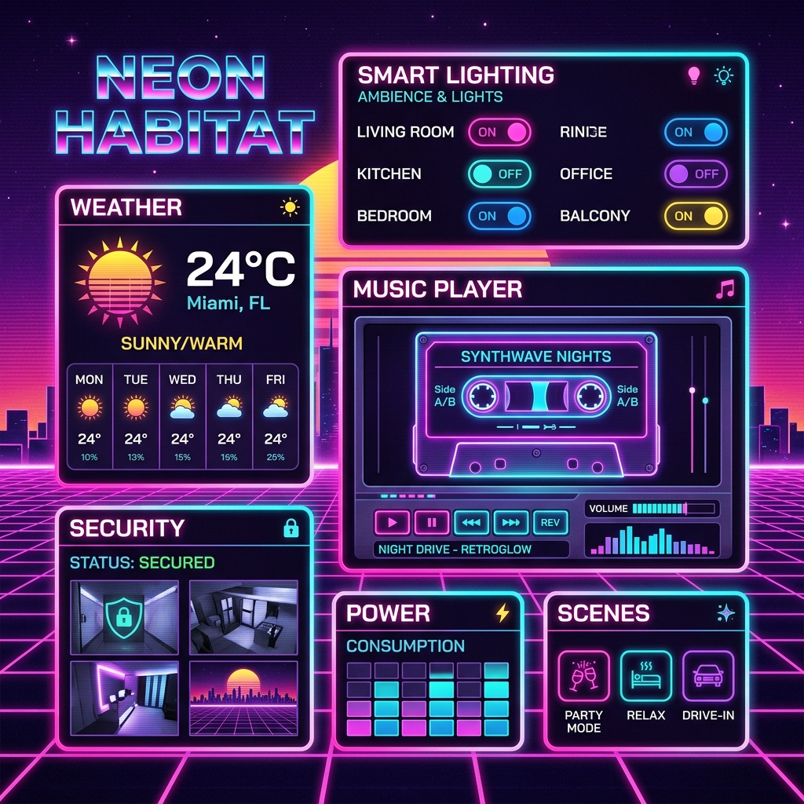

# Smart Home Dashboard v3 · Neo Deck 🏠👻



Ein modernes Smart-Home-Wandpanel für ein **Lenovo Tab M10 FHD Plus (10.3", 1920×1200, 16:10)** im Querformat. Optimiert für den dauerhaften Betrieb im **Fully Kiosk Browser**.

### 🎨 Dashboard Themes (Vorschau)
Das Dashboard unterstützt vier komplett unterschiedliche, umschaltbare Design-Stile:

*   **Neo-Aurora (Standard):** Transparente Frosted-Glass-Karten mit weichen Auras und leuchtenden Widgets.
    
*   **Cyberpunk HUD:** Taktischer High-Tech-Look in Orange/Amber mit scharfen Ecken und Gitternetz-Hintergrund.
    
*   **Cozy Nordic Dark:** Beruhigende, organische Ästhetik mit salbeigrünen Akzenten und weichen Schatten.
    
*   **Retrowave Laser Synth:** Nostalgischer 80er-Retro-Look in Pink/Cyan mit perspektivischer Laser-Bodenlinie.
    

## ✨ Highlights

- **Multi-Theme-System:** 4 edle, frei umschaltbare Premium-Designs (Neo-Aurora Glassmorphism, Cyberpunk Tactical HUD, Cozy Nordic Dark, Retrowave Laser Synth) mit persistentem Speicher im Browser.
- **Neo Aurora Command Deck:** dunkles, hochwertiges Wall-Panel-Design mit Aurora-Glow, Glas-/Metal-Karten und adaptivem 2-Reihen-Layout.
- **Adaptive Widgets:** Layout passt sich besser an Seitenverhältnis und Fully-Kiosk-Viewport an, statt unten Inhalte abzuschneiden.
- **Wetter Pro:** Open-Meteo Daten mit Temperatur, Gefühlter Temperatur, Min/Max, Luftfeuchte, Regenwahrscheinlichkeit, Wind, Luftdruck, Wolken und UV-Index.
- **Smart Home / Tasmota:** lokale Geräteverwaltung, Scan im privaten Heimnetz, Toggle-Buttons mit Statusanzeige und Offline-Dimmung.
- **AM2301 Klima-Sensor:** eigenes Tasmota-Sensor-Widget mit Temperatur-/Feuchte-Gauges, Taupunkt und konfigurierbarer lokaler IP.
- **Abfallkalender:** `.ics` Upload, kommende Leerungen, farbige Mülltonnen-Icons und kalendertagsgenaue Heute/Morgen-Anzeige ohne Uhrzeit-Versatz.
- **Live Radio:** Preset-Tasten im Dashboard, Senderverwaltung in den Präferenzen, HLS/MP3/AAC-Unterstützung und Schutz gegen ungewollten Autostart beim Tablet-Wakeup.
- **System Status:** Live CPU/RAM/Temperatur/Netzwerk per Socket.IO.
- **Fritz!Box Monitor:** Live Netzwerk- & Internet-Status (LEDs/Latenz in ms) sowie ein Echtzeit-Anruf-Monitor (Port 1012) mit bildschirmfüllendem Live-Anrufer-Overlay (Toast) und historischer Anrufliste.
- **Touch-ready:** Drag & Drop via Sortable.js mit Fully-Kiosk-kompatibler Verzögerung.

## 🧭 Bedienung

### Präferenzen
Über das Menü oben rechts lassen sich konfigurieren:

- Multi-Theme
- sichtbare Widgets
- Tasmota-Geräte und Subnetz-Scan
- AM2301/Tasmota-Klima-Sensor-IP
- Abfallkalender-Upload
- Wetterstandort
- Radio-Sender und Preset-Tasten
- Fritz!Box-Verbindungsdaten und Call-Monitor

### Radio-Autoplay-Schutz
Das Radio startet **nur** noch durch expliziten Klick auf:

- Play-Button
- Preset-Taste

Beim Schlafen/Aufwecken des Tablets wird ein aktiver Stream hart gestoppt und das Audio-Element entfernt, damit Fully Kiosk/Android keinen Stream selbstständig wiederbelebt.

## 🛠️ Architektur

- **Backend:** Node.js, Express.js
- **Realtime:** Socket.IO
- **Systemdaten:** `systeminformation`
- **Uploads:** `multer`
- **Frontend:** Vanilla JS, CSS Grid, Sortable.js, HLS.js
- **Wetter:** Open-Meteo API, ohne API-Key
- **Port:** `8443`
- **HTTPS & HTTP-Fallback:** Läuft standardmäßig auf HTTPS mit Zertifikat unter `ssl/`. Bietet einen automatischen, sicheren Fallback auf Standard-HTTP, falls keine SSL-Zertifikate vorhanden sind (ideal für lokale Windows-Testserver).

## 🔐 Sicherheit & lokale Dateien

Nicht committen:

- `ssl/`
- `radio.json`
- `tasmota.json`
- `uploads/`
- `node_modules/`
- `fritzbox.json`
- `fritzbox_calls.json`

Die `.gitignore` ist entsprechend vorbereitet.

Backend-Härtungen:

- JSON Body-Limit
- `.ics` Upload-Limit und Dateifilter
- Tasmota Toggle/Scan/Sensor-Abfrage nur für private IPv4-Netze
- Radio-URLs werden validiert/normalisiert

## 🗓️ Abfallkalender-Datumslogik

Ganztägige `.ics` Termine werden als lokale Kalendertage verglichen. Dadurch wird z.B. eine morgige Leerung morgens nicht mehr fälschlich als „Heute“ angezeigt, nur weil die aktuelle Uhrzeit bereits nach `00:00` liegt.

## 🌡️ AM2301/Tasmota Klima-Sensor

Das Sensor-Widget fragt lokal einen Tasmota-Endpunkt ab:

```text
GET /api/tasmota/sensor?ip=192.168.178.40
```

Die IP ist im Präferenzen-Menü änderbar und wird im Browser per `localStorage` gespeichert. Das Backend akzeptiert bewusst nur private IPv4-Adressen.

## 📞 Fritz!Box Monitor & Call-Monitor

Das Dashboard enthält ein integriertes, hochmodernes Fritz!Box-Widget zur Echtzeitüberwachung deines Heimnetzwerks und der Telefonie:

- **Live Netzwerk- & Internet-Status (LEDs):** Das System misst alle 10 Sekunden asynchron und extrem ressourcenschonend die Latenz zu deinem lokalen Gateway (Fritz!Box) und einem öffentlichen DNS (`1.1.1.1`), um die Latenzen in Millisekunden und den Online-Zustand per leuchtender LED (Grün/Rot) darzustellen.
- **Echtzeit-Anruf-Monitor:** Verbindet sich backendseitig über einen robusten, selbstheilenden TCP-Client direkt mit Port `1012` deiner Fritz!Box. Bei einem eingehenden Anruf wird sofort ein bildschirmfüllendes, pulsierendes Pop-up auf allen Tablets eingeblendet. Nach Gesprächsende wird der Anruf mit Gesprächsdauer in die Anrufliste übernommen.
- **Anrufliste:** Zeigt die letzten 10 Anrufe mit Typ-Symbolen (Eingehend, Ausgehend, Verpasst, Verbunden) und Dauer in Echtzeit an.

### 🔐 Wichtig für deine Privatsphäre (Datensicherheit)
Die Zugangsdaten deiner Fritz!Box und dein Anrufprotokoll werden **ausschließlich lokal** in den Dateien `fritzbox.json` und `fritzbox_calls.json` gespeichert. Beide Dateien sind permanent über `.gitignore` blockiert und werden **niemals auf GitHub hochgeladen**!

### ⚙️ Einrichtung des Call-Monitors
Damit die Live-Anrufe auf Port 1012 an das Dashboard gesendet werden, muss der Call-Monitor deiner Fritz!Box einmalig freigeschaltet werden. Wähle dazu einfach an einem an der Fritz!Box angeschlossenen Telefon die Tastenkombination:
- **Aktivieren:** `#96*5*` (und abheben / wählen)
- **Deaktivieren (optional):** `#96*6*`

## 🚀 Betrieb

### Windows (Vollautomatisch & Empfohlen)
Doppelklicke im Projektverzeichnis einfach auf die Datei:
```text
start-dashboard.bat
```
*Diese Batch-Datei prüft automatisch Ihre Node.js-Pfade (inklusive Selbstreparatur bei fehlenden globalen Umgebungsvariablen), installiert eventuell fehlende Bibliotheken (`npm install`), öffnet direkt Ihren Webbrowser mit dem Dashboard (`http://localhost:8443`) und startet den Server.*

### Linux & macOS (Manuell)
```bash
npm install
npm start
```

Standardmäßig läuft der Server (auf Linux/macOS mit SSL) auf:

```text
https://0.0.0.0:8443
```

Optional per Environment überschreibbar:

```bash
PORT=8443 HOST=0.0.0.0 npm start
```

## 🐋 Docker & TrueNAS Setup Guide

Dieses Projekt wurde vollständig containerisiert. Alle Konfigurationen, hochgeladenen Kalenderdateien (`calendar.ics`), Anruflisten und Einstellungen werden über ein einziges persistentes Volume gesichert. Das macht die Installation auf einem **TrueNAS SCALE** Server oder jedem anderen Docker-Host im Heimnetzwerk extrem einfach und sicher.

### 📂 Struktur der persistenten Daten

Alle Daten werden im Container unter `/app/data` gespeichert. Wenn du dieses Verzeichnis auf einen Host-Pfad mountest, entstehen dort automatisch folgende Dateien und Ordner:
* `tasmota.json` (Deine Tasmota-Geräte)
* `radio.json` (Deine Webradio-Sender)
* `cameras.json` (Deine Kamera-Konfigurationen)
* `fritzbox.json` (Deine Fritz!Box Login-Konfiguration)
* `fritzbox_calls.json` (Deine Fritz!Box Anrufliste)
* `presence.json` (Deine Anwesenheits-Demos/Konfigurationen)
* `uploads/` (Enthält deine hochgeladene `calendar.ics`)
* `ssl/` (Optional für HTTPS: `key.pem` und `cert.pem`)

---

### 🛠️ Methode 1: Docker Compose (Empfohlen)

Wenn du SSH-Zugriff auf dein TrueNAS hast oder ein Tool wie **Portainer / Dockge** auf TrueNAS nutzt, ist dies der schnellste Weg:

1. **Repository klonen** (falls nicht bereits geschehen):
   ```bash
   git clone https://github.com/Daddelgreis74/smart-home-dashboard.git
   cd smart-home-dashboard
   ```

2. **Ordner für Daten erstellen:**
   ```bash
   mkdir data
   ```

3. **Container bauen und starten:**
   ```bash
   docker compose up -d --build
   ```

Das Dashboard ist nun unter `http://<DEINE-TRUENAS-IP>:8443` erreichbar!

---

### 🎛️ Methode 2: TrueNAS SCALE Web-Oberfläche (Custom App)

TrueNAS SCALE ermöglicht es, beliebige Docker-Images direkt über die Benutzeroberfläche als App zu starten.

#### Schritt 1: Docker-Image vorbereiten
Da das Image auf deinem Server gebaut werden muss, kannst du es entweder lokal auf TrueNAS bauen und in die lokale Registry legen, oder du baust es auf deinem PC und schiebst es hoch.
Alternativ kannst du es direkt über SSH auf TrueNAS bauen:
```bash
docker build -t local/smart-home-dashboard:latest .
```

#### Schritt 2: App in TrueNAS SCALE erstellen
1. Navigiere im TrueNAS-Webinterface zu **Apps** und klicke auf **Discover Apps** (oben rechts).
2. Klicke auf **Custom App** (oder **Launch Docker Image**).
3. Konfiguriere die App wie folgt:

##### 1. Application Name
* **Application Name:** `smart-home-dashboard`

##### 2. Container Image Details
* **Image Repository:** `local/smart-home-dashboard` (oder der Name deines gebauten Images)
* **Image Tag:** `latest`

##### 3. Port Forwarding (Netzwerk)
Füge eine neue Port-Weiterleitung hinzu:
* **Container Port:** `8443`
* **Host Port:** `8443` (oder ein freier Wunschport deiner Wahl)
* **Protocol:** `TCP`

##### 4. Storage (Persistente Daten sichern)
Um sicherzustellen, dass deine Einstellungen bei einem App-Update nicht gelöscht werden, erstelle einen **Host Path Volume Mount**:
* **Mount Path (im Container):** `/app/data`
* **Host Path (auf TrueNAS ZFS Pool):** Wähle einen Ordner auf deinem ZFS-Pool (z. B. `/mnt/tank/apps/smart-home-dashboard/data`).

*(Hinweis: TrueNAS erstellt diesen Ordner automatisch. Alle JSON-Konfigurationen und Kalenderdateien werden dort dauerhaft und sicher auf deinen ZFS-Festplatten gesichert).*

#### Schritt 3: Speichern & Starten
Klicke auf **Save**. TrueNAS lädt die App und startet sie. Sobald der Status auf `Active` steht, kannst du das Dashboard über die IP deines TrueNAS-Servers auf Port `8443` aufrufen!

---

### 🔒 Kalender & SSL einbinden

* **Kalender:** Lade deine `.ics`-Datei einfach wie gewohnt direkt über die Dashboard-Oberfläche in den Einstellungen hoch. Sie wird automatisch in deinem persistenten Host-Pfad unter `/data/uploads/calendar.ics` abgelegt und bleibt dauerhaft gespeichert.
* **HTTPS / SSL:** Wenn du eine sichere Verbindung wünschst, erstelle einfach in deinem gemounteten `data`-Ordner ein Unterverzeichnis `ssl` und lege dort `key.pem` und `cert.pem` ab. Der Server erkennt diese beim nächsten Start automatisch und schaltet auf HTTPS um.

---

### 🧭 Bedienung & Steuerung im Alltag (Für Einsteiger)

Da wir den Container mit dem Parameter `-d` (detached) im Hintergrund gestartet haben, läuft das Dashboard vollautomatisch und lautlos im Hintergrund. Du musst die Konsole im normalen Betrieb nicht geöffnet lassen.

Solltest du das Dashboard doch einmal steuern oder aktualisieren wollen, navigiere in der Konsole auf deinem TrueNAS in den Ordner `smart-home-dashboard` und verwende diese einfachen Befehle:

#### 🟢 1. Dashboard aufrufen
Öffne einen beliebigen Webbrowser auf deinem PC, Tablet oder Smartphone und gib Folgendes ein:
```text
http://<DEINE-TRUENAS-IP>:8443
```

#### 🔴 2. Dashboard stoppen (Ausschalten)
Wenn du den Server warten oder das Dashboard vorübergehend abschalten willst:
```bash
docker compose down
```

#### 🟢 3. Dashboard starten (Einschalten)
Um das Dashboard wieder einzuschalten:
```bash
docker compose up -d
```

#### 🔍 4. Status prüfen
Um zu sehen, ob das Dashboard aktiv ist und fehlerfrei läuft:
```bash
docker compose ps
```

---

### 🔄 Updates einspielen

Wenn eine neue Version des Dashboards auf GitHub veröffentlicht wird, kannst du dein TrueNAS ganz einfach und ohne Datenverlust updaten:

1. Navigiere in deinen Ordner auf dem TrueNAS:
   ```bash
   cd /dein-pfad-zu/smart-home-dashboard
   ```
2. Lade den neuesten Code von GitHub herunter:
   ```bash
   git pull
   ```
3. Baue und starte den Container neu:
   ```bash
   docker compose up -d --build
   ```

*Hinweis: Deine Einstellungen (Kameras, Fritz!Box-Passwörter etc.) im Ordner `data/` bleiben bei diesem Vorgang komplett unangetastet und sicher auf deinen ZFS-Platten liegen!*


## 🧪 Checks

```bash
node --check server.js
node --check public/app.js
npm audit --omit=dev
```

## 📁 Projektpfad

```text
/root/.openclaw/workspace/smart-home-dashboard
```

---

Mit 👻 entwickelt von **Neo**, dem digitalen Hausgeist.
